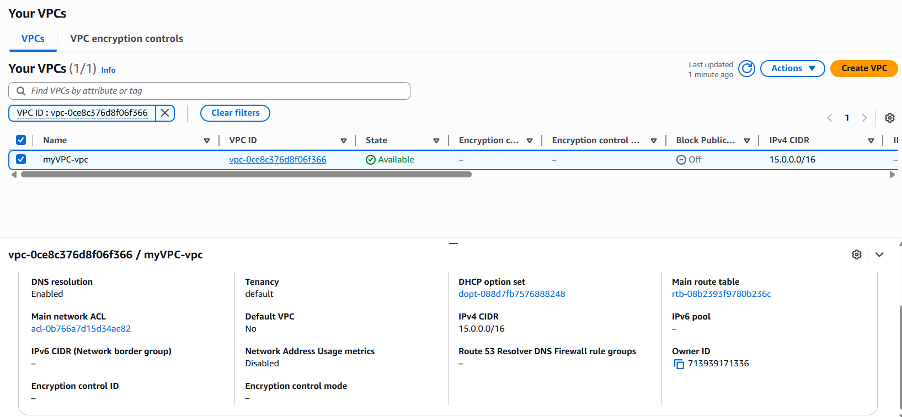
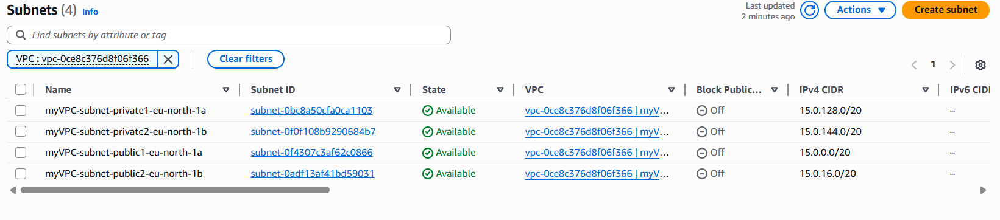
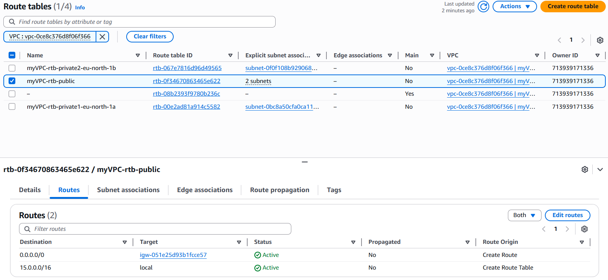
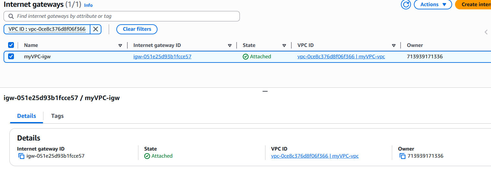
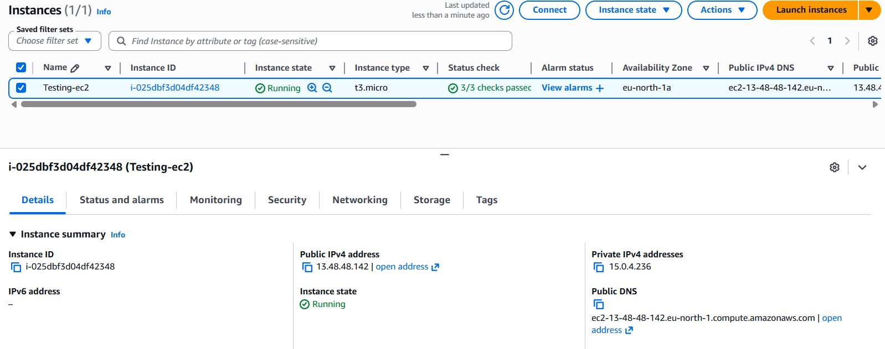
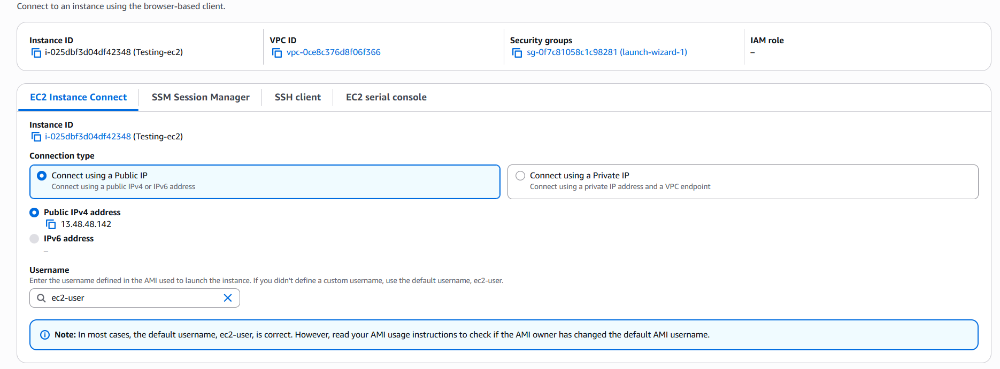
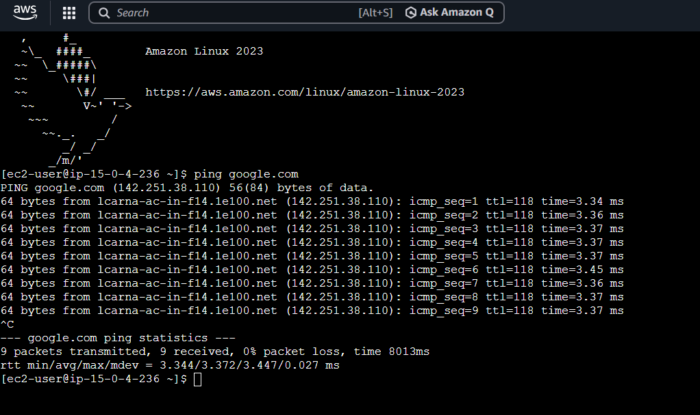

#  AWS Virtual Private Cloud (VPC) Network Design

## Project Overview
This project demonstrates the design and implementation of a Virtual Private Cloud (VPC) in AWS. It includes creation of public and private subnets, configuration of route tables, Internet Gateway setup, EC2 instance deployment, and network connectivity testing.

---

## Objectives
- Design a scalable cloud network using AWS VPC
- Configure public and private subnets
- Set up Internet Gateway for external connectivity
- Deploy EC2 instances within the VPC
- Validate network connectivity using real testing

---

## Architecture Summary
The network consists of:
- One VPC (15.0.0.0/16)
- Public Subnet (for EC2 access)
- Private Subnet (secure internal layer)
- Internet Gateway (external access)
- Route Tables (traffic control)
- EC2 Instance for testing connectivity

---

## Project Screenshots

### 🔷 VPC Overview

---

### 🔷 Subnets Configuration

---

### 🔷 Route Table Configuration

---

### 🔷 Internet Gateway Setup

---

### 🔷 EC2 Instance Overview

---

### 🔷 EC2 Connection (SSH / Console)

---

### 🔷 Network Connectivity Test (Ping Google)

---

## Key Learning Outcomes
- Understanding AWS VPC architecture and networking concepts
- Configuring subnets and routing in cloud environments
- Managing Internet Gateway and network traffic flow
- Deploying and accessing EC2 instances
- Testing real-world cloud connectivity

---

## Tools & Services Used
- Amazon Web Services (AWS)
- VPC (Virtual Private Cloud)
- EC2 (Elastic Compute Cloud)
- Internet Gateway
- Route Tables
- Linux Terminal (SSH)

---

## Author
Chandupa Silva  
Network Engineering Student (UCSC)
